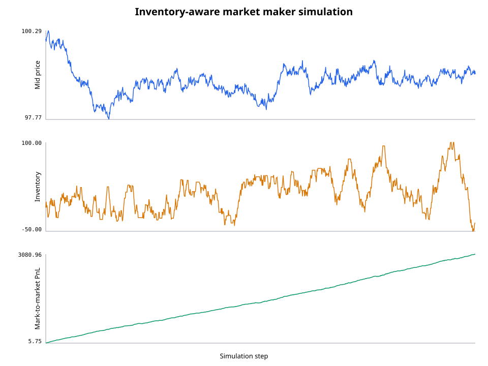

# LOB Market Maker

[](https://github.com/cedarquant/lob-market-maker/actions/workflows/ci.yml)
[](https://www.python.org/)
[](LICENSE)

An event-driven **limit order book and inventory-aware market-making engine** written in Python. The project combines exchange microstructure, a deterministic matching engine, a simplified Avellaneda--Stoikov quoting policy, and a reproducible backtest in one small, testable codebase.



## What this demonstrates

- **Exchange mechanics:** price-time priority, limit and market orders, cancellations, partial fills, multi-level sweeps, and immutable trade records.
- **Market data:** best bid/ask, spread, mid-price, and aggregated depth at arbitrary levels.
- **Quantitative strategy:** reservation-price inventory skew and risk/liquidity-aware optimal spread.
- **Research workflow:** seeded simulation, step-level CSV metrics, JSON summary, performance plot, unit tests, linting, and CI.

## Architecture

```text
Incoming order flow ──> LimitOrderBook ──> Trade events
                            │                   │
                    BBO / depth state          ▼
                            │          inventory + cash ledger
                            ▼                   │
                  quoting policy <─────────────┘
                            │
                       bid / ask orders
```

| Module | Responsibility |
|---|---|
| `models.py` | Typed order, side, order-type, and trade domain objects |
| `orderbook.py` | Continuous price-time-priority matching and market-data views |
| `strategy.py` | Inventory-aware quote calculation and mark-to-market accounting |
| `simulation.py` | Fundamental-price process, background liquidity, order flow, and metrics |
| `cli.py` | Reproducible command-line entry point and artifact export |

The book stores a FIFO queue at each price. The best opposing price is consumed first; within that level, the oldest order trades first. A market order never rests. A crossing limit order consumes available liquidity and rests any remainder at its limit price.

## Quoting model

The strategy is inspired by the finite-horizon framework of Avellaneda and Stoikov. Its reservation price is

$$r_t = s_t - q_t\gamma\sigma^2(T-t),$$

where $s_t$ is the mid-price, $q_t$ inventory, $\gamma$ risk aversion, and $\sigma$ the modeled volatility. The quoted half-spread is

$$\delta_t = \frac{\gamma\sigma^2(T-t)}{2} + \frac{1}{\gamma}\log\left(1+\frac{\gamma}{k}\right),$$

where $k$ controls assumed liquidity/order-arrival sensitivity. Quotes are $r_t \pm \delta_t$, rounded outward to the tick. A long position lowers both quotes to encourage selling; a short position raises them. Hard inventory limits cap new risk.

This is deliberately an educational, discrete-time approximation. It does **not** calibrate a live arrival-intensity model, model queue position, latency, fees, adverse selection, or exchange-specific order types.

## Quick start

```bash
git clone https://github.com/cedarquant/lob-market-maker.git
cd lob-market-maker
python -m venv .venv
source .venv/bin/activate
python -m pip install -e ".[dev]"
lobmm --steps 1000 --seed 7 --output results
```

The command prints headline metrics and creates:

- `results/metrics.csv` — mid-price, spread, five-level depth, inventory, cash, PnL, and cumulative trades per step;
- `results/summary.json` — final PnL/inventory and fill statistics;
- `results/performance.svg` — dependency-free price, inventory, and PnL time series.

Run the quality suite with:

```bash
ruff check .
pytest --cov=lobmm --cov-report=term-missing
```

## Reproducible example

The committed example uses `--steps 1000 --seed 7`. Results are an illustration of engine behavior, not a claim of tradable performance. Because every random draw is seeded, the run can be reproduced exactly on the same Python implementation.

| Metric | Example result |
|---|---:|
| Total trade events | 1,015 |
| Market-maker fills | 654 |
| Final inventory | -36 |
| Maximum absolute inventory | 100 |
| Final mark-to-market PnL | 3,080.96 |

## Design choices and invariants

- Monetary values use `Decimal`; simulation shocks enter the book only after tick rounding.
- Execution price is always the resting maker's price.
- IDs for resting orders are unique, and completed/cancelled orders leave the active index.
- Trade records identify maker, taker, aggressor side, price, quantity, and logical timestamp.
- The simulator rebuilds exogenous depth each step, while the strategy cancels/requotes, making the control loop explicit and easy to extend.
- The seed is local to each simulation, so tests do not mutate process-global randomness.

## Extending the project

Natural next steps include calibrated Hawkes/Poisson order flow, queue-position modeling, maker/taker fees, latency, multiple assets, historical L2 replay, and parameter sweeps with Sharpe/drawdown attribution. The engine API is intentionally separate from the strategy and simulator so those additions do not require rewriting matching logic.

## References and originality

- Marco Avellaneda and Sasha Stoikov, *High-frequency trading in a limit order book* (2008), for the reservation-price and spread intuition.
- [`silue-dev/limit-order-book-market-making`](https://github.com/silue-dev/limit-order-book-market-making) was reviewed as a high-level example of combining a Python book with a market-maker. This repository is a clean-room implementation with a different API, data model, simulation design, accounting, test suite, and documentation; no source code was copied.

## Disclaimer

For education and research only. This simulator omits material real-market risks and is not investment advice or a production trading system.
